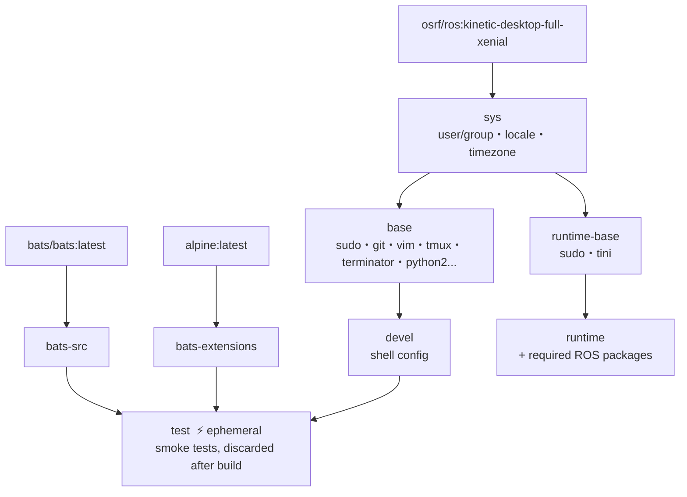

# OSRF ROS Kinetic Docker Environment

**[English](README.md)** | **[繁體中文](doc/README.zh-TW.md)** | **[简体中文](doc/README.zh-CN.md)** | **[日本語](doc/README.ja.md)**

> **TL;DR** — One-command ROS 1 Kinetic containerized dev environment based on `osrf/ros` desktop-full image (x86_64 only). Auto-detects UID/GID, supports X11 GUI forwarding, multi-stage build with smoke test verification.
>
> ```bash
> ./build.sh && ./run.sh
> ```

---

## Table of Contents

- [Features](#features)
- [Quick Start](#quick-start)
- [Usage](#usage)
- [Usage as Subtree](#usage-as-subtree)
- [Configuration](#configuration)
- [Architecture](#architecture)
- [Smoke Tests](#smoke-tests)
- [Directory Structure](#directory-structure)
- [Updating docker\_template](#updating-template)

---

## Features

- **OSRF desktop-full**: full ROS desktop environment including RViz, Gazebo, etc.
- **Multi-stage build**: sys → base → devel / test / runtime, choose as needed
- **Smoke Test**: Bats tests run automatically during build to verify environment
- **Docker Compose**: single `compose.yaml` manages all targets
- **Auto-detection**: `setup.sh` auto-detects UID/GID/workspace, generates `.env`
- **Modular config**: shell config managed via [template](https://github.com/ycpss91255-docker/template) subtree
- **X11 forwarding**: supports GUI applications (RViz, Terminator, etc.)

> **Note**: This image uses `osrf/ros` which only supports **x86_64**. For ARM/Raspberry Pi, use [ros_kinetic](https://github.com/ycpss91255-docker/ros_kinetic) instead.

## Quick Start

```bash
# 1. Build dev environment (auto-generates .env on first run)
./build.sh

# 2. Start container
./run.sh

# 3. Enter a running container
./exec.sh

# Or use docker compose directly
docker compose up -d devel
docker compose exec devel bash
docker compose down
```

## Usage

### Development (devel)

Full dev environment with tmux, terminator, vim, git, etc.

```bash
./build.sh                       # Build (default: devel)
./build.sh --no-env test         # Build without refreshing .env
./run.sh                         # Start (default: devel)
./run.sh --no-env -d             # Background start, skip .env refresh
./exec.sh                        # Enter running container

docker compose build devel       # Equivalent command
docker compose run --rm devel    # One-off start
docker compose up -d devel       # Start in background
docker compose exec devel bash   # Enter running container
```

### Testing (test)

Smoke tests run automatically during build; build fails if tests fail.

```bash
./build.sh test
# or
docker compose --profile test build test
```

### Deployment (runtime)

Minimal image with only essential ROS packages.

```bash
./build.sh runtime
./run.sh runtime
# or
docker compose --profile runtime build runtime
docker compose --profile runtime run --rm runtime
```

## Usage as Subtree

This repo can be embedded into another project via `git subtree`, letting the project carry its own Docker dev environment.

### Adding to Your Project

```bash
git subtree add --prefix=docker/osrf_ros_kinetic \
    https://github.com/ycpss91255-docker/osrf_ros_kinetic.git main --squash
```

Example directory structure after adding:

```text
my_robot_project/
├── src/                         # Project source code
├── docker/osrf_ros_kinetic/     # Subtree
│   ├── build.sh
│   ├── run.sh
│   ├── compose.yaml
│   ├── Dockerfile
│   └── template/
└── ...
```

### Building and Running

```bash
cd docker/osrf_ros_kinetic
./build.sh && ./run.sh
```

`build.sh` uses `--base-path` internally, so path detection works correctly regardless of where you run it from.

### Workspace Detection

<details>
<summary>Click to expand detection behavior when used as subtree</summary>

When the subtree sits at `my_robot_project/docker/osrf_ros_kinetic/`:

- **IMAGE_NAME**: directory name is `osrf_ros_kinetic` (not `docker_*`), so detection falls through to `.env.example` which has `IMAGE_NAME=osrf_ros_kinetic` — works correctly.
- **WS_PATH**: strategy 1 (sibling scan) and strategy 2 (path traversal) may not match, so strategy 3 (fallback) resolves to the parent directory (`my_robot_project/docker/`).

**Recommendation**: after the first build, edit `WS_PATH` in `.env` to point to your actual workspace. The value is preserved on subsequent builds.

</details>

### Syncing with Upstream

```bash
git subtree pull --prefix=docker/osrf_ros_kinetic \
    https://github.com/ycpss91255-docker/osrf_ros_kinetic.git main --squash
```

> **Notes**:
> - Local modifications are tracked by git normally.
> - `subtree pull` may produce merge conflicts if upstream changed the same files you modified locally.
> - Do **not** modify `template/` inside the subtree — it is managed by the env repo's own subtree.

## Configuration

### .env Parameters

Automatically refreshed on every `./build.sh` or `./run.sh` (use `--no-env` to skip). Refer to `.env.example` to create manually:

| Variable | Description | Example |
|----------|-------------|---------|
| `USER_NAME` | Container username | `developer` |
| `USER_GROUP` | User group | `developer` |
| `USER_UID` | User UID (matches host) | `1000` |
| `USER_GID` | User GID (matches host) | `1000` |
| `HARDWARE` | Hardware architecture | `x86_64` |
| `DOCKER_HUB_USER` | Docker Hub username | `myuser` |
| `GPU_ENABLED` | GPU support | `true` / `false` |
| `IMAGE_NAME` | Image name | `osrf_ros_kinetic` |
| `WS_PATH` | Workspace mount path | `/home/user/catkin_ws` |

### Auto-detection Details

`setup.sh` automatically detects system parameters and generates `.env`. The two most complex detections are documented below.

<details>
<summary>Click to expand detection logic</summary>

#### IMAGE_NAME Inference

Scans the repo directory path to derive the image name:

| Priority | Rule | Example Path | Result |
|:--------:|------|-------------|--------|
| 1 | Last directory matches `docker_*` → strip prefix | `/home/user/docker_osrf_ros_kinetic` | `osrf_ros_kinetic` |
| 2 | Scan path (right→left) for `*_ws` → use prefix | `/home/user/ros_kinetic_ws/docker_osrf_ros_kinetic` | `ros_kinetic` |
| 3 | Read `IMAGE_NAME` from `.env.example` | — | value in `.env.example` |
| 4 | Fallback | — | `unknown` |

#### WS_PATH Workspace Detection

Three-strategy search to locate the workspace mount path:

| Priority | Strategy | Condition | Result |
|:--------:|----------|-----------|--------|
| 1 | Sibling scan | Current dir is `docker_*` and sibling `*_ws` exists | Sibling `*_ws` absolute path |
| 2 | Path traversal | Walk path upward, find first `*_ws` component | That `*_ws` directory |
| 3 | Fallback | None of the above | Parent directory of repo |

**Example** (strategy 1):
```
/home/user/
├── docker_osrf_ros_kinetic/ ← repo (current dir)
└── osrf_ros_kinetic_ws/     ← detected as WS_PATH
```

**Example** (strategy 2):
```
/home/user/catkin_ws/src/docker_osrf_ros_kinetic/
                     ↑ found *_ws while traversing upward
```

> If `.env` already exists and `WS_PATH` points to a valid directory, detection is skipped and the existing value is preserved.

</details>

### Language

`setup.sh` displays messages in English by default. Use `--lang zh` for Chinese when running `build.sh`:

```bash
# Re-generate .env with Chinese prompts
rm .env
SETUP_LANG=zh ./build.sh
```

## Architecture

### Docker Build Stage Diagram



### Stage Description

| Stage | FROM | Purpose |
|-------|------|---------|
| `bats-src` | `bats/bats:latest` | Bats binary source, not shipped |
| `bats-extensions` | `alpine:latest` | bats-support, bats-assert, not shipped |
| `sys` | `osrf/ros:kinetic-desktop-full-xenial` | OS base: user/group, locale, timezone |
| `base` | `sys` | Common dev tools (apt) |
| `devel` | `base` | Full dev environment with shell config |
| `test` | `devel` | Injects bats, runs smoke/, discarded after build |
| `runtime-base` | `sys` | Minimal runtime base, no dev tools |
| `runtime` | `runtime-base` | Adds required ROS packages |

## Smoke Tests

See [TEST.md](doc/test/TEST.md) for details.

## Directory Structure

```text
osrf_ros_kinetic/
├── compose.yaml                 # Docker Compose definition
├── Dockerfile                   # Multi-stage build
├── build.sh                     # Build script (runs from any directory)
├── run.sh                       # Run script (runs from any directory)
├── exec.sh                      # Enter running container
├── stop.sh                      # Stop running container
├── .env.example                 # Environment variable template
├── .hadolint.yaml               # Hadolint ignore rules
├── script/
│   └── entrypoint.sh            # Container entrypoint
├── doc/
│   ├── README.zh-TW.md          # Traditional Chinese
│   ├── README.zh-CN.md          # Simplified Chinese
│   └── README.ja.md             # Japanese
├── .github/workflows/           # CI/CD
│   ├── main.yaml                # Main pipeline
│   ├── build-worker.yaml        # Docker build + smoke test
│   └── release-worker.yaml      # GitHub Release
├── test/smoke/             # Bats environment tests
│   ├── ros_env.bats
│   ├── script_help.bats
│   └── test_helper.bash
└── template/         # git subtree (v1.4.0)
    └── src/
        ├── setup.sh             # System detection + .env generation
        └── config/              # shell/pip/terminator/tmux config
```

## Updating template

```bash
git subtree pull --prefix=template \
    https://github.com/ycpss91255-docker/template.git v1.4.0 --squash
```
